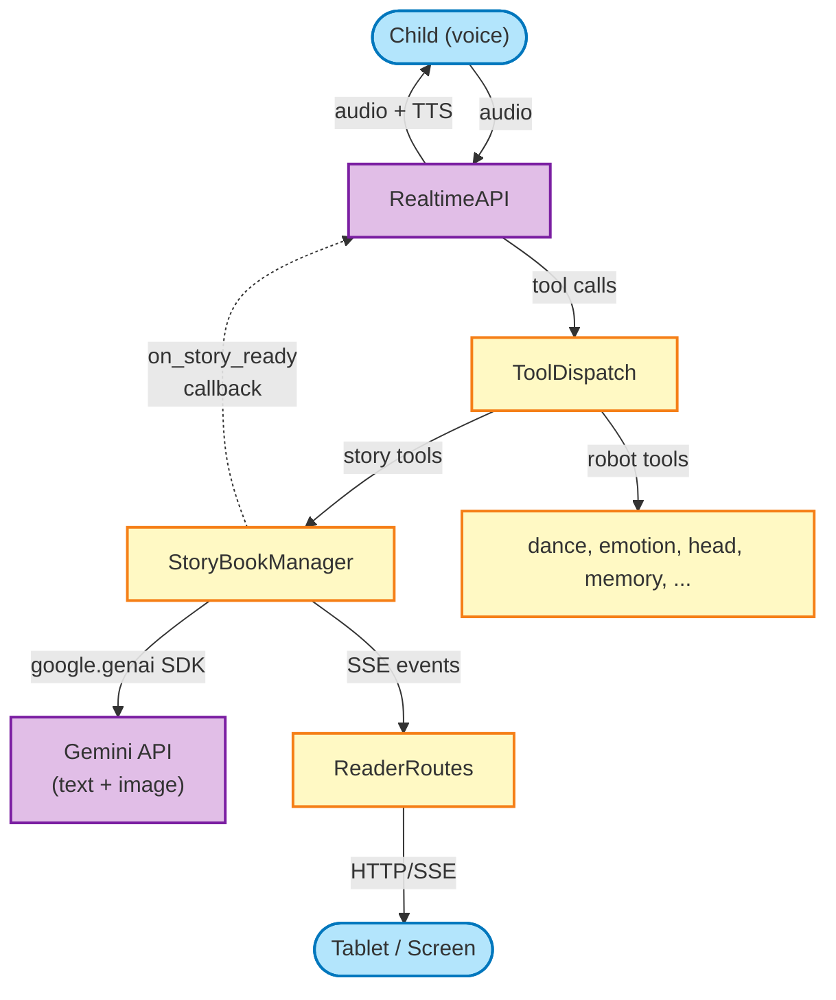
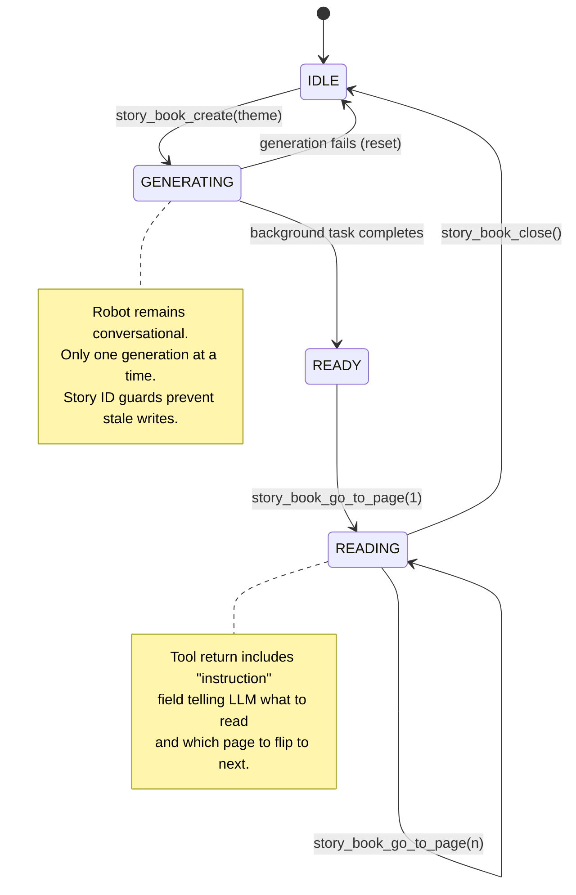
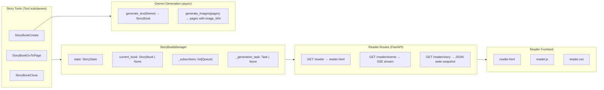
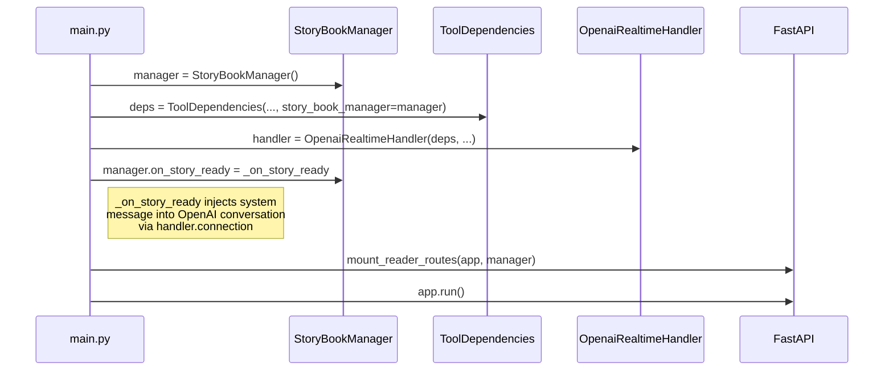
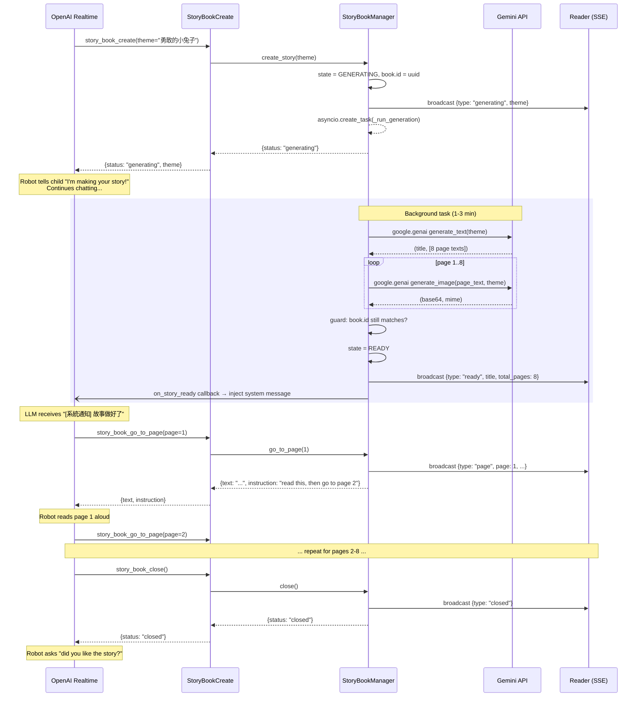

# Interactive Storyteller — Architecture Design

> Companion to [interactive-storyteller-prd.md](./interactive-storyteller-prd.md).
> This document covers component design, data flow, and public interfaces only — not implementation details.

---

## Design Decisions (lessons from v1, v2, feature branch)

| Decision | Chosen approach | Why | Rejected alternative |
|----------|----------------|-----|----------------------|
| State ownership | `StoryBookManager` class, injected via `ToolDependencies` | Testable, no global coupling | Module-level singleton (v1) — hard to test, tight coupling |
| Story-ready notification | Callback (`on_story_ready`) set during wiring | Clean, no polling, no handler ref in tools | Polling watcher task (v1) — wasteful; direct handler ref (feature branch) — tight coupling |
| Per-tool LLM guidance | `instruction` field in tool return value | LLM reads it naturally as part of tool result | Separate `_TOOL_RESPONSE_INSTRUCTIONS` dict (v2) — requires handler-level plumbing |
| Gemini client | `google.genai` SDK | Official SDK; handles auth, retries, API versioning, response parsing; image response format is non-trivial to parse manually | Raw `httpx` REST (v1, feature branch) — brittle if API shapes change, more boilerplate |
| Frontend files | Separated `reader.html` + `reader.js` + `reader.css` | Maintainable, cacheable | Single monolithic HTML (v1, v2) |
| Race condition guard | Story ID checked before background task writes back | Prevents stale task from killing a newer story | No guard (v1, v2) |
| Page indexing | 1-based (user-facing and internal) | Matches natural language ("page 1"), less confusing for LLM | 0-based (feature branch) — LLM sometimes says "page 0" |
| SSE state recovery | Send current state snapshot on new subscriber connect | Handles page refresh without losing position | No recovery (v1) — refresh = blank screen |
| Tool loading | Reload on profile switch (not just at boot) | Storyteller tools must appear when switching to storyteller profile | Load once at import (all 3) — tools don't change on switch |
| Error strategy | Raise exceptions, never `sys.exit()` in library code | Testable, recoverable | `sys.exit(1)` at import (feature branch) — kills test runners |

---

## System Context

Where the storyteller feature fits within the existing conversation app.



---

## State Machine



**States:**

| State | Description | Robot behavior | Reader display |
|-------|-------------|---------------|----------------|
| `IDLE` | No active story | Normal conversation | Idle screen |
| `GENERATING` | Background task running | Chatting, dancing, etc. | Loading screen (theme title + animation) |
| `READY` | Story complete, awaiting first page turn | Announces story is ready | Loading screen (until first page) |
| `READING` | Robot reading pages aloud | Reads page text, auto-advances | Current page (image + text + indicator) |

---

## Component Diagram



---

## Data Models

```
StoryState (Enum)
├── IDLE
├── GENERATING
├── READY
└── READING

StoryPage (dataclass)
├── page_number: int          # 1-based
├── text: str                 # 2-4 sentences, Traditional Chinese
├── image_b64: str            # base64-encoded PNG/JPEG
└── image_mime: str            # "image/png" or "image/jpeg"

StoryBook (dataclass)
├── id: str                   # UUID — guards against stale background tasks
├── theme: str
├── title: str                # generated by Gemini
└── pages: list[StoryPage]    # always NUM_PAGES (8)
```

---

## Class & Function Signatures

### StoryBookManager

Central orchestrator. Created once in `main.py`, injected into tools via `ToolDependencies`.

```
class StoryBookManager:
    state: StoryState
    current_book: StoryBook | None
    on_story_ready: Callable[[str, int], Awaitable[None]] | None

    async create_story(theme: str) -> dict
        # Validates no concurrent generation.
        # Creates StoryBook with new UUID.
        # Sets state = GENERATING, launches background task.
        # Broadcasts "generating" event to SSE subscribers.
        # Returns immediately: {"status": "generating", "theme": ...}

    async go_to_page(page: int) -> dict
        # Validates state is READY or READING, page in bounds.
        # Sets state = READING, broadcasts "page" event.
        # Returns: {"status": "ok", "page": N, "total": 8,
        #           "text": "...", "is_last_page": bool,
        #           "instruction": "read this text, then call ..."}

    async close() -> dict
        # Broadcasts "closed" event.
        # Resets state = IDLE, current_book = None.
        # Returns: {"status": "closed", "title": ...}

    def subscribe() -> asyncio.Queue
        # Adds queue to _subscribers.
        # Sends immediate state snapshot (catch-up).

    def unsubscribe(queue: asyncio.Queue) -> None
        # Removes queue from _subscribers.

    def _broadcast(event: dict) -> None
        # put_nowait to all subscriber queues.

    async _run_generation(book_id: str, theme: str) -> None
        # Background task. Guarded by book_id == current_book.id.
        # Phase 1: generate_text(theme) → pages with text
        # Phase 2: generate_images(pages) → pages with image_b64
        # On success: state = READY, invoke on_story_ready callback.
        # On failure: state = IDLE, broadcast error, log.
```

### Gemini Client (`story_gemini.py`)

Uses `google.genai` SDK. Client is created once and reused.

```
_client: genai.Client  # initialized with GEMINI_API_KEY

async generate_text(theme: str) -> tuple[str, list[str]]
    # Calls gemini-2.5-flash via google.genai async client.
    # Uses response_mime_type="application/json" for structured output.
    # Returns (title, [page_texts...]).
    # Raises on API error or malformed response.

async generate_image(page_text: str, theme: str) -> tuple[str, str]
    # Calls gemini-2.0-flash-preview-image-generation via google.genai.
    # Extracts base64 + mime from response.candidates[].content.parts[].inline_data.
    # Returns (base64_data, mime_type).
    # Returns ("", "image/png") on failure (graceful degradation).
```

### Story Tools

All tools receive `StoryBookManager` via `ToolDependencies`. No global imports.

```
class StoryBookCreate(Tool):
    name = "story_book_create"
    parameters: {theme: str}

    is_available() -> bool
        # True only if GEMINI_API_KEY is configured.

    async run(theme) -> dict
        # Delegates to manager.create_story(theme).

class StoryBookGoToPage(Tool):
    name = "story_book_go_to_page"
    parameters: {page: int}  # 1-based

    async run(page) -> dict
        # Delegates to manager.go_to_page(page).
        # Return value includes "instruction" field for LLM.

class StoryBookClose(Tool):
    name = "story_book_close"
    parameters: {}

    async run() -> dict
        # Delegates to manager.close().
```

### Reader Routes

```
mount_reader_routes(app: FastAPI, manager: StoryBookManager) -> None

    GET /reader
        # Serves reader.html (static file).

    GET /reader/events
        # SSE endpoint.
        # Subscribes to manager, streams JSON events.
        # Sends state snapshot on connect (recovery).
        # Heartbeat every 15s.
        # Unsubscribes in finally block.

    GET /reader/story
        # Returns current state as JSON (for page-refresh recovery).
```

### Reader Frontend

```
reader.html  — Minimal markup: 3 screen containers (idle, loading, reading, end).
reader.js    — EventSource client, screen transitions, auto-reconnect (3s).
reader.css   — Dark theme, warm accents, responsive, fade-in animations.
```

---

## SSE Event Protocol

Events sent from `StoryBookManager` → Reader via `/reader/events`:

| Event | Payload | Trigger |
|-------|---------|---------|
| `state` | `{type: "state", state: "idle"}` | On subscribe (catch-up), or reset |
| `generating` | `{type: "generating", theme, title?}` | `create_story()` called |
| `ready` | `{type: "ready", title, total_pages}` | Generation complete |
| `page` | `{type: "page", page, total_pages, text, image_b64, image_mime}` | `go_to_page()` called |
| `closed` | `{type: "closed"}` | `close()` called |
| `error` | `{type: "error", message}` | Generation failed |
| `heartbeat` | `{type: "heartbeat"}` | Every 15s (keep-alive) |

---

## Wiring Diagram (main.py)

How components are created and connected at startup.



### Story-Ready Callback

```
async _on_story_ready(title: str, total_pages: int) -> None:
    # Injects a system message into the OpenAI Realtime conversation:
    # "[系統通知] 故事書《{title}》已完成！共 {total_pages} 頁。
    #  請告訴小朋友故事做好了，然後用 story_book_go_to_page 從第 1 頁開始朗讀。"
    # Then triggers response.create() to wake the LLM.
```

---

## Generation Sequence



---

## File Layout

```
src/reachy_mini_conversation_app/
├── story_book_manager.py        # StoryBookManager class + StoryBook/StoryPage dataclasses
├── story_gemini.py              # generate_text(), generate_image() — google.genai SDK
├── story_reader_routes.py       # mount_reader_routes(), SSE endpoint, snapshot endpoint
├── tools/
│   ├── story_book_create.py     # StoryBookCreate(Tool)
│   ├── story_book_go_to_page.py # StoryBookGoToPage(Tool)
│   └── story_book_close.py      # StoryBookClose(Tool)
├── profiles/storyteller/
│   ├── instructions.txt         # Storyteller persona system prompt
│   ├── tools.txt                # Tool whitelist for this profile
│   └── voice.txt                # "coral"
└── static/
    ├── reader.html              # Minimal markup (3 screens)
    ├── reader.js                # SSE client, screen transitions
    └── reader.css               # Dark theme, responsive, animations
```

---

## Key Invariants

1. **One story at a time.** `create_story()` rejects if `state != IDLE`.
2. **Story ID guard.** Background task checks `book.id` before writing results. If user starts a new story while old one generates, the old task discards its results.
3. **No global state.** `StoryBookManager` is instantiated and injected — never imported as a singleton.
4. **Tools reload on profile switch.** When `apply_personality` switches to/from storyteller, the tool list sent to OpenAI must reflect the new profile's `tools.txt`.
5. **Graceful image failure.** If an image fails to generate, the page still has text. Reader hides the image area. Story continues.
6. **No `sys.exit()`.** All errors raise exceptions. Callers decide recovery strategy.
7. **Queue drain, not replace.** Audio queue is drained in-place, never swapped out from under a consumer.
8. **POST-only writes.** Settings endpoints that mutate state use POST, never GET.
